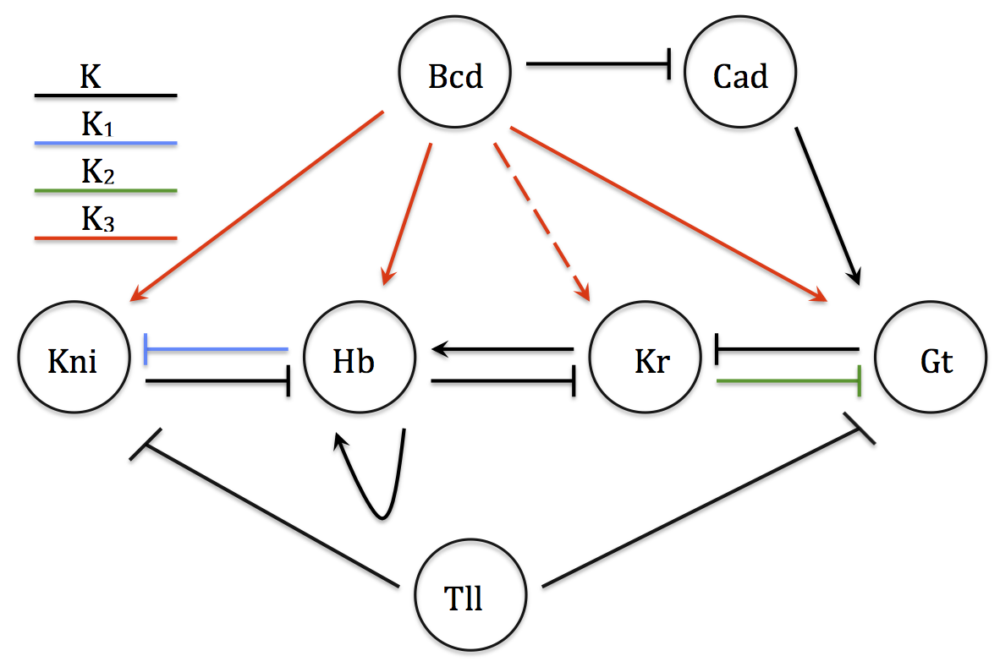

## Models ##



## Marginal Likelihoods ##

```{r, echo = FALSE}
df = data.frame("A6" = c(-9.46962405213, -9.50089667559, -9.52253718728, -9.49932308288, -10.1063856956, 
                         -9.52494932347, -9.55284070668, -9.50099308371, -9.46453511368, -12.1988282722),
                "B7" = c(-8.97302579936, -8.51209685281, -8.43381409237, -8.51082511019, -8.60108344422,
                         -9.07549195164, -8.42832296147, -8.48234592556, -8.44797232801, -8.51967012454),
                "B7r" = c(36.7142181688, 36.7218709452, 36.7454983718, 32.3593979911, 36.6456229386,
                          36.7035130141, 36.8059319033, 36.8025165781, 36.8320631685, 36.7936761827),
                "C8" = c(37.1407970864, 37.9142439599, 37.8001082552, 38.0327165566, 35.0484076826,
                         37.4893197421, 37.4419304962, 37.8945288471, 37.5151081025, 37.1667978806)
                )
boxplot(as.matrix(df))
```

